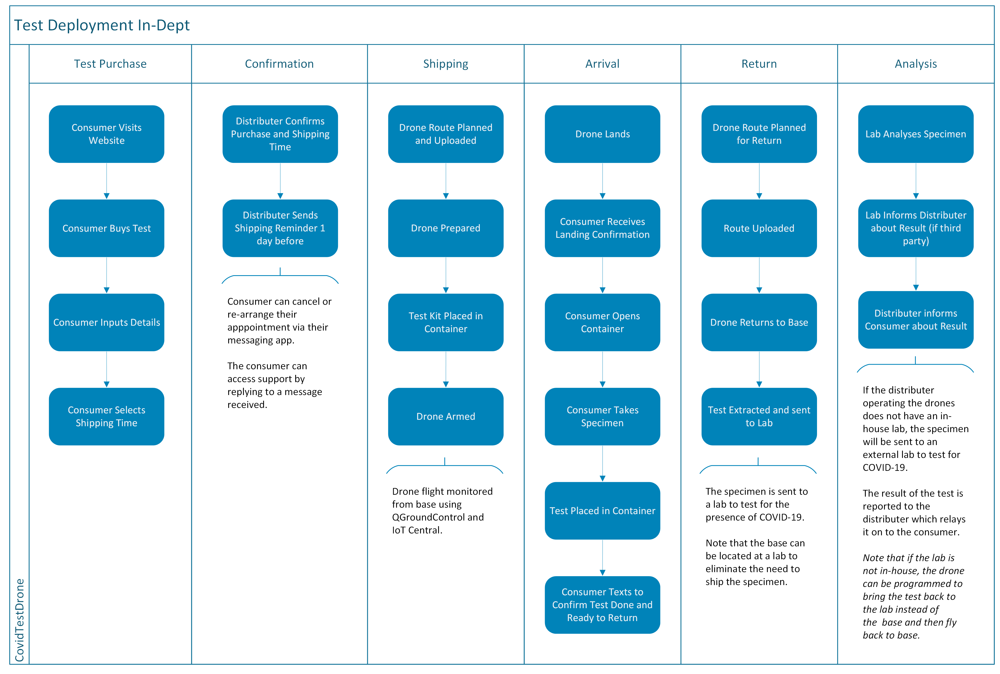
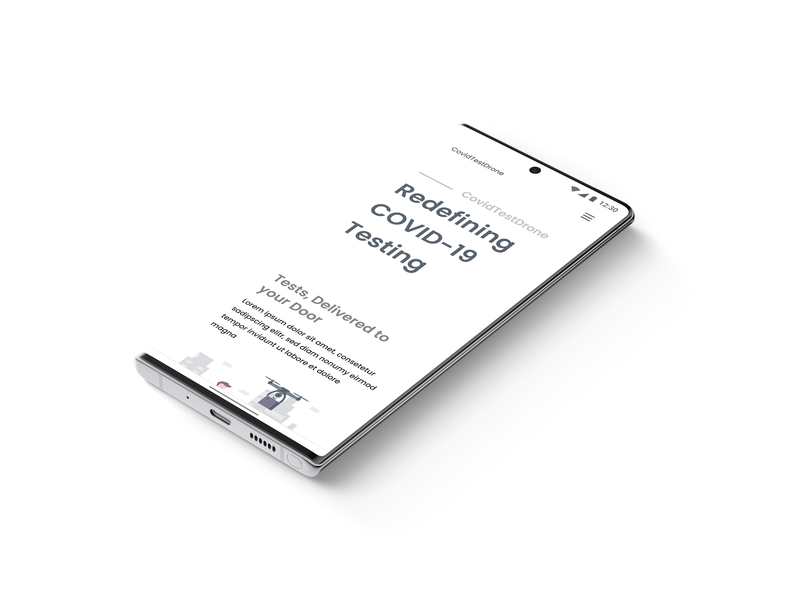
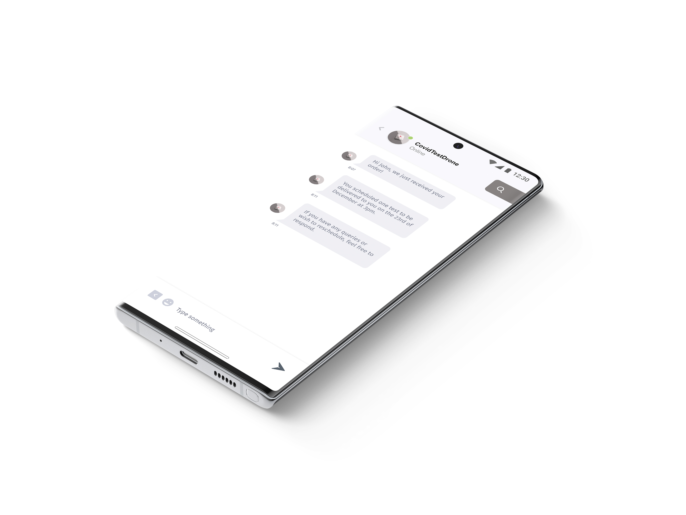
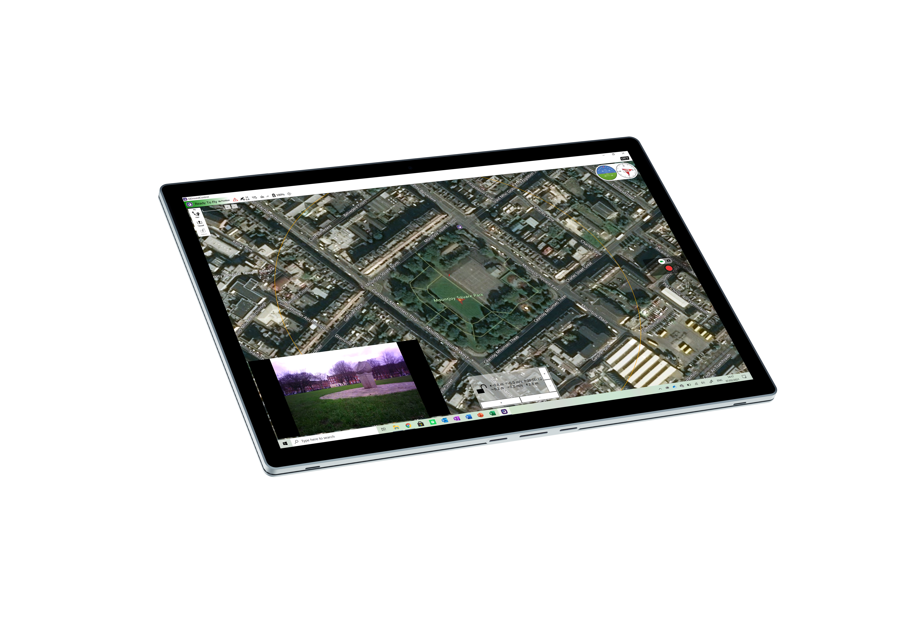
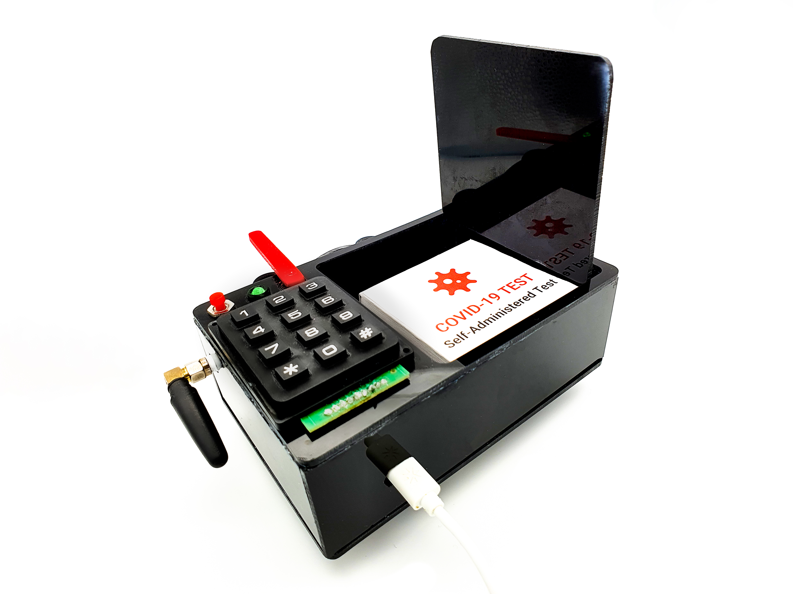
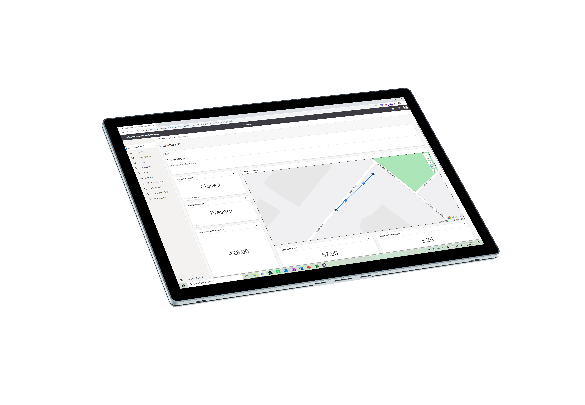

CovidTestDrone enables self-administered COVID-19 tests to be delivered within minutes to patient’s homes via drone delivery and returned to the lab to be analysed. There is no need for patients to leave their homes nor get into contact with other individuals to get tested. Tests can be provided on-demand meaning that there is no need to wait to get symptoms checked by a GP in order to get tested. Finally, the tests provided are precise and non-invasive, creating an overall great user experience.
The application is built around a drone delivery system that allows individuals to receive a self-administered lower nasal swab COVID-19 test at home via a drone and then return the sample to the lab via the same drone after administering the swab.

The application consists of two parts: the drone delivery system itself and the assisting applications built around it. These systems will be briefly discussed below with the help of an abstract process diagram.

For the purpose of this walk-through, the solution will be implemented by a private company. The first step in the process is the purchase of a test. In a private company model, the test will be sold to individuals online. The consumer can purchase the test via the provider’s website and then input their details (address, phone number, etc.). The consumer will then be required to select a time when the test can be shipped to them.

The consumer will then be introduced in the provider’s database. The confirmation stage involves the company introducing the consumer in their consumer messaging client and sending them a confirmation text to let them know that their order was placed and confirm the details with them.

The provider will also send out another text a day and an hour before the shipment respectively to remind the consumer of the shipping. The consumer can reply to these automated messages at any time to be connected with a support employee.

The next step is shipping the test kit. This is where the drone comes in. The drone base is an NXP Hovergames Drone Kit. This is a reference kit that is highly customisable, easy to assemble and maintain, and runs on Dronecode firmware allowing for advanced autopilot deliveries to be executed.

The drone can be monitored live at the base by the workforce through the use of QGroundControl. This is an open source application used to plan routes for drones to execute and monitor them during flight. This means that the exact location, pitch, yaw and roll, and compass readings along with all other onboard sensor readings can be monitored remotely, in real time through QGroundControl.

The drone can also be controlled remotely via QGroundControl: commands can be given to the drone if for example it has to return or if there has been a change in the flight plan. This allows full control over the functionality of the drone remotely if an unexpected occurrence happened.

The drone will stream live footage back to the basestation via the Nav-Q onboard computer. This device will stream a video feed from a camera mounted on the drone live to the QGroundControl application.

The drone has been customised to carry a COVID-19 self-administered testing kit with it. Self-administered tests are lower nasal swabs and non-invasive, meaning that they are a gentle swab and do not require to be pushed hard in the nose and mouth like traditional swabs. A container has been attached to the drone to securely ship the test in a climatically controlled environment. There are specific guidelines for the transport of specimens to ensure that they do not get damaged; according to the CDC, samples must be shipped to the lab for analysis within 72 hours. During this time, they must be stored between 2-8 degrees Celsius on dry ice.

This shipping container has been designed to ship tests with these shipping conditions in mind to ensure the maximum accuracy of the tests. I built this shipping solution from scratch to ensure its perfect integration with the system.

The container has a locking mechanism that requires the consumer to input a PIN to open the container and extract the test. This ensures that only authorised individuals have access to the test kit and specimen. The device is also equipped with a helpful LED to indicate if the container is locked or unlocked and signalise any errors with the shipment.

The device uses GSM connectivity to transmit key data back to the base. The device gathers information such as its geolocation, as well as if the container is open or closed. This data is reported to an online dashboard which can be accessed from the base. Operators can also control the container remotely via the dashboard – the unlock PIN can be changed and the container can be locked and unlocked together with other functions.

The container is also equipped with a variety of sensors that collect crucial data while in operation and report it live to the backend. The device is equipped with a temperature and humidity sensor allowing the temperature and humidity of the container to be streamed live to the backend ensuring that the kit is held in appropriate conditions.

The container is also equipped with an IR breakbeam sensor which checks if the test kit is in the container and reports this live to the backend. This allows the operator to always know if the test kit is in the container.

The drone will be loaded with a test at the hospital or base station, a route for the drone to get to its destination will be planned using QGroundControl and the drone will then be instructed to take off. When the drone lands, the provider will inform the consumer where the drone landed (e.g. back yard) and will provide the PIN to open the container via the messaging client.

The consumer will then open the container and extract the test. They will then go indoors to administer the swab and place it back in the box according to the guidelines provided. The consumer can let the operator know that the container was put back in the drone and that it is ready to take off. The operator checks to make sure that the container is locked through the dashboard and that the test kit is in the container and then instructs the drone to return to base/deliver tests directly to a laboratory (if in range).

The PIN is provided to the individual in charge of handling the test. If the drone returned to base, the operator would open the container and ship the test to a laboratory. If the drone returned to the lab, the container would be opened, and the sample would be analysed there. The drone can take off from the lab after the sample was extracted and return to base, thus completing a journey.